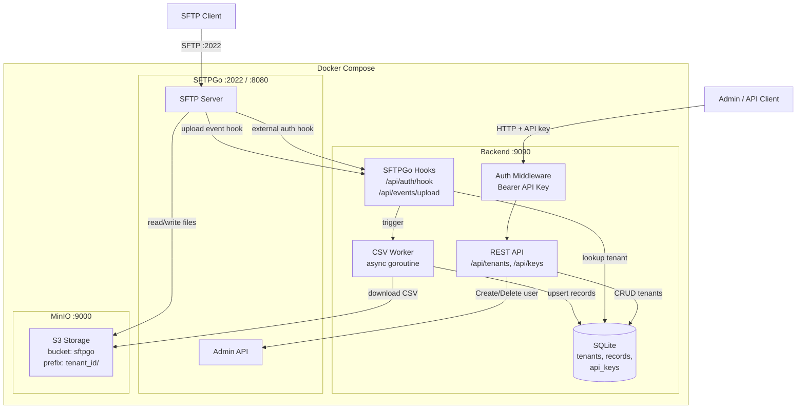
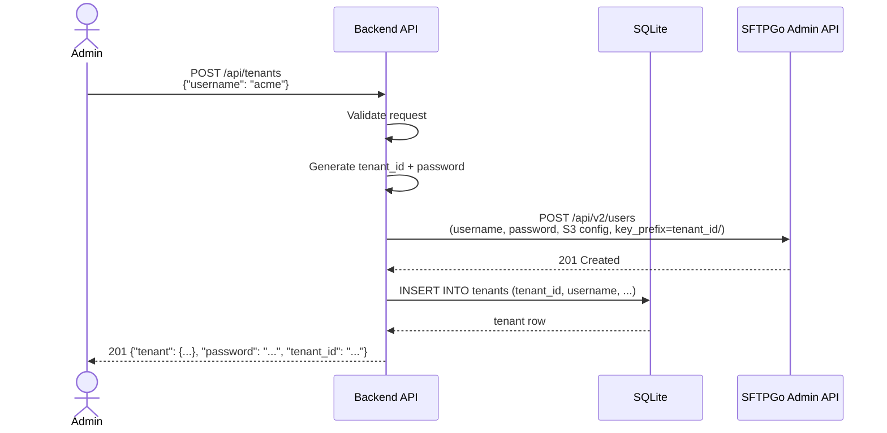
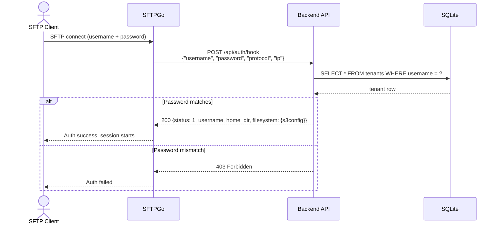
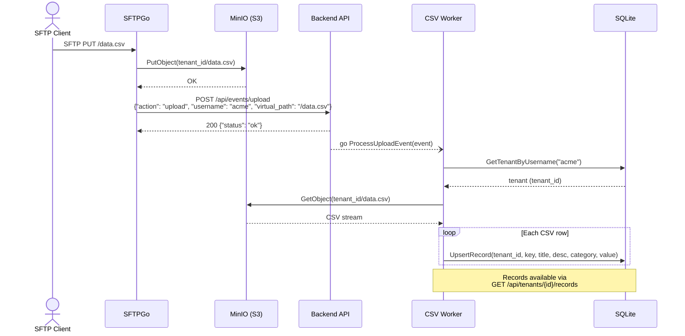

# SFTPGo Manager

Go backend for multi-tenant SFTP user management. Each tenant gets an isolated S3 prefix, and uploaded CSV files are automatically parsed into a records table.

Built on top of [SFTPGo](https://github.com/drakkan/sftpgo) for SFTP and [MinIO](https://min.io/) for S3-compatible object storage.

## Architecture



## Sequence Diagrams

### Tenant Creation



### SFTP Authentication (External Auth Hook)



### CSV Upload and Processing



## Quick Start

```bash
docker compose up -d --build
```

Wait for all services to become healthy, then follow the usage examples below.

## Services

| Service     | Port              | Description                   |
|-------------|-------------------|-------------------------------|
| **backend** | 9090              | Management API + Swagger UI   |
| **sftpgo**  | 8080 (HTTP), 2022 (SFTP) | SFTPGo server         |
| **minio**   | 9000 (S3), 9001 (Console) | S3-compatible storage |

## API Endpoints

| Method | Path                       | Auth     | Description                      |
|--------|----------------------------|----------|----------------------------------|
| POST   | `/api/keys`                | none     | Bootstrap an API key             |
| POST   | `/api/tenants`               | API key  | Create a new tenant              |
| GET    | `/api/tenants`               | API key  | List all tenants                 |
| GET    | `/api/tenants/{id}`          | API key  | Get tenant details               |
| DELETE | `/api/tenants/{id}`          | API key  | Remove tenant                    |
| POST   | `/api/tenants/{id}/validate` | API key  | Check tenant is active in SFTPGo |
| PUT    | `/api/tenants/{id}/keys`     | API key  | Update SSH public key            |
| GET    | `/api/tenants/{id}/records`  | API key  | List ingested records            |
| POST   | `/api/auth/hook`           | internal | SFTPGo external auth hook        |
| POST   | `/api/events/upload`       | internal | SFTPGo upload event hook         |

All endpoints except `/api/keys`, `/swagger/*`, and internal hooks require `Authorization: Bearer <api_key>`.

## Swagger UI

Open http://localhost:9090/swagger/index.html after starting the stack.

## Usage

### 1. Bootstrap an API key

```bash
curl -s -X POST localhost:9090/api/keys | jq .
```

### 2. Create a tenant

```bash
curl -s -H "Authorization: Bearer <KEY>" \
     -X POST localhost:9090/api/tenants \
     -d '{"username":"tenant1"}' | jq .
```

### 3. Upload a CSV via SFTP

```bash
sshpass -p '<PASSWORD>' sftp -P 2022 -o StrictHostKeyChecking=no tenant1@localhost <<< "put /tmp/data.csv"
```

### 4. Query records

```bash
curl -s -H "Authorization: Bearer <KEY>" localhost:9090/api/tenants/1/records | jq .
```

## CSV Format

The CSV must have a header row. Required columns: `key`, `title`, `value`. Optional columns: `description`, `category`.

```csv
key,title,description,category,value
REC-001,First Record,A description,category-a,10.5
REC-002,Second Record,Another description,category-b,20.0
```

Column order does not matter. Non-CSV files are silently ignored.

## Configuration

All configuration is via environment variables:

| Variable           | Default                    | Description              |
|--------------------|----------------------------|--------------------------|
| `SFTPGO_URL`       | `http://localhost:8080`    | SFTPGo API URL           |
| `SFTPGO_ADMIN_USER`| `admin`                    | SFTPGo admin username    |
| `SFTPGO_ADMIN_PASS`| `admin`                    | SFTPGo admin password    |
| `LISTEN_ADDR`      | `:9090`                    | Backend listen address   |
| `DATA_DIR`         | `/srv/sftpgo/data`         | Base data directory      |
| `S3_BUCKET`        | `sftpgo`                   | S3 bucket name           |
| `S3_REGION`        | `us-east-1`                | S3 region                |
| `S3_ENDPOINT`      | _(empty = no S3)_          | S3/MinIO endpoint        |
| `S3_ACCESS_KEY`    | _(empty)_                  | S3 access key            |
| `S3_SECRET_KEY`    | _(empty)_                  | S3 secret key            |

## Project Structure

```
.
├── main.go              # Entrypoint, routing, graceful shutdown
├── config.go            # Environment-based configuration
├── db.go                # SQLite schema + queries
├── auth.go              # API key middleware
├── sftpgo_client.go     # SFTPGo REST API client
├── handlers.go          # HTTP handlers
├── worker.go            # S3 download + CSV parsing
├── *_test.go            # Unit tests
├── docs/                # Generated Swagger docs
├── Dockerfile           # Multi-stage Go build
└── docker-compose.yml   # Full dev stack
```

## Testing

```bash
go test ./... -v
go test -race ./...
```

## Development

Regenerate Swagger docs after changing handler annotations:

```bash
go install github.com/swaggo/swag/cmd/swag@latest
swag init
```
